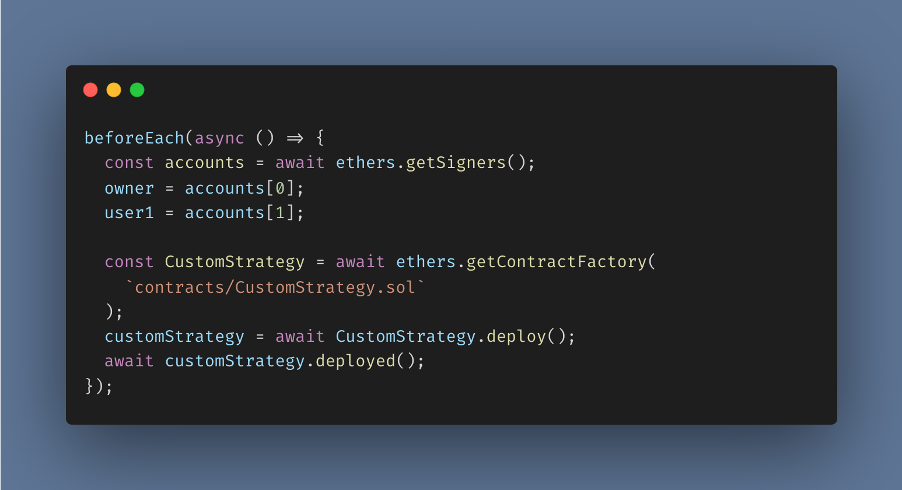

# Case Study: Hardhat Network Forking and Its Impact on a False Positive Test

## Motivation

- This repository presents an engaging case study that highlights how Hardhat network forking led to a false positive test case in a smart contract deployment. Through the following code snippets, we'll explore a situation where a smart contract, **despite not being sent any ether during deployment, ends up holding ether**.
- **Disclaimer**: As this project is under active development, the complete codebase has not been made available. However, the code snippets provided below should offer enough insight to understand the issue at hand.

## A Quick Look at Hardhat Network Forking

- [Hardhat network forking](https://hardhat.org/hardhat-network/docs/guides/forking-other-networks) is a powerful feature that lets you fork any network and run your tests against the forked version. This is particularly useful when you want to test your contracts against any network without actually deploying them.

## Configuring Hardhat to Fork Ethereum's Goerli Testnet

- In our project's `hardhat.config.ts` file, we've used the `networks` configuration shown above to fork the _Goerli testnet_.

## Setting Up the Test Case

- To ensure the `customStrategy` smart contract is deployed before every it test block execution, we've utilized a `beforeEach` block. As you can see, **the contract is deployed with zero ether**.

- Within the `it` test block, we first print the `customStrategy` smart contract's _address_ and also its _balance_. The function call to the smart contract that follows is not relevant to the issue being discussed.

## Analyzing the Test Result

- As shown in the terminal screenshot, the `customStrategy` smart contract's _address_ is [0xe6AFcC58b60dA41C5B2789E0f3F7B53a6ea98F74](https://goerli.etherscan.io/address/0xe6AFcC58b60dA41C5B2789E0f3F7B53a6ea98F74), and its _balance_ is `10000000000000000 wei` or `0.01 ether`.
- The test case fails due to the final `expect` statement, which expects the contract's balance to be `0`.

## Unraveling the Mystery

- The `customStrategy` smart contract was deployed with `0 ether`. However, its balance is actually `0.01 ether`. This unexpected outcome occured because **the address to which the smart contract had been deployed already held ether, specifically on the Goerli testnet**, which was forked by our Hardhat project.
- By looking up the address [0xe6AFcC58b60dA41C5B2789E0f3F7B53a6ea98F74](https://goerli.etherscan.io/address/0xe6AFcC58b60dA41C5B2789E0f3F7B53a6ea98F74) on the [Goerli testnet block explorer](https://goerli.etherscan.io/), you can see that it's a _regular account address_ holding `0.01 ether`.
- **When Hardhat forks a network, it copies the state of the network at a particular block number**. 
- This case study serves as a reminder for developers to be cautious when working with forked networks and to ensure that their test cases account for such nuances.
