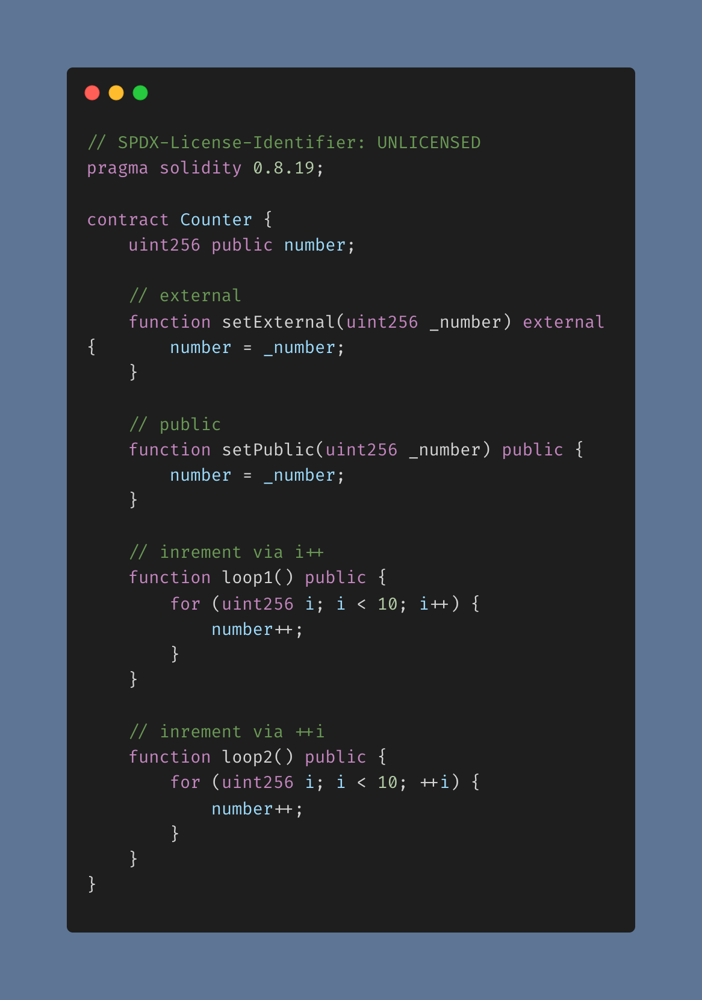
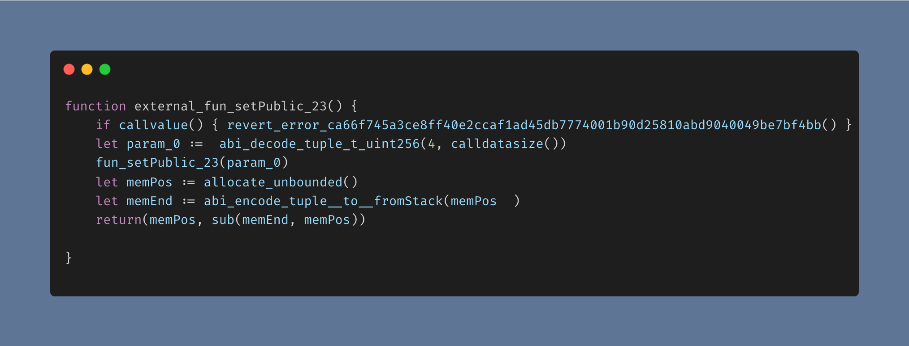
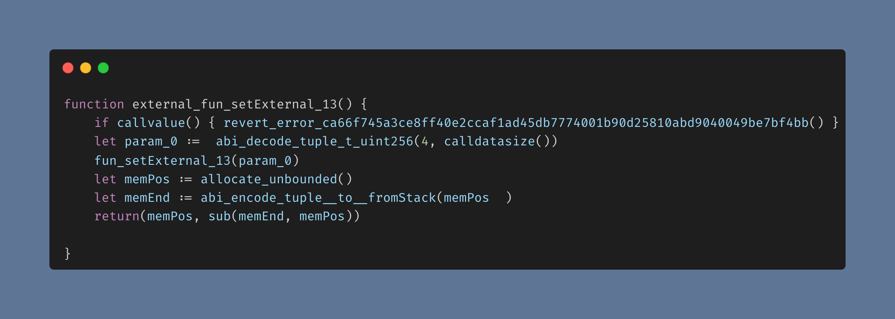
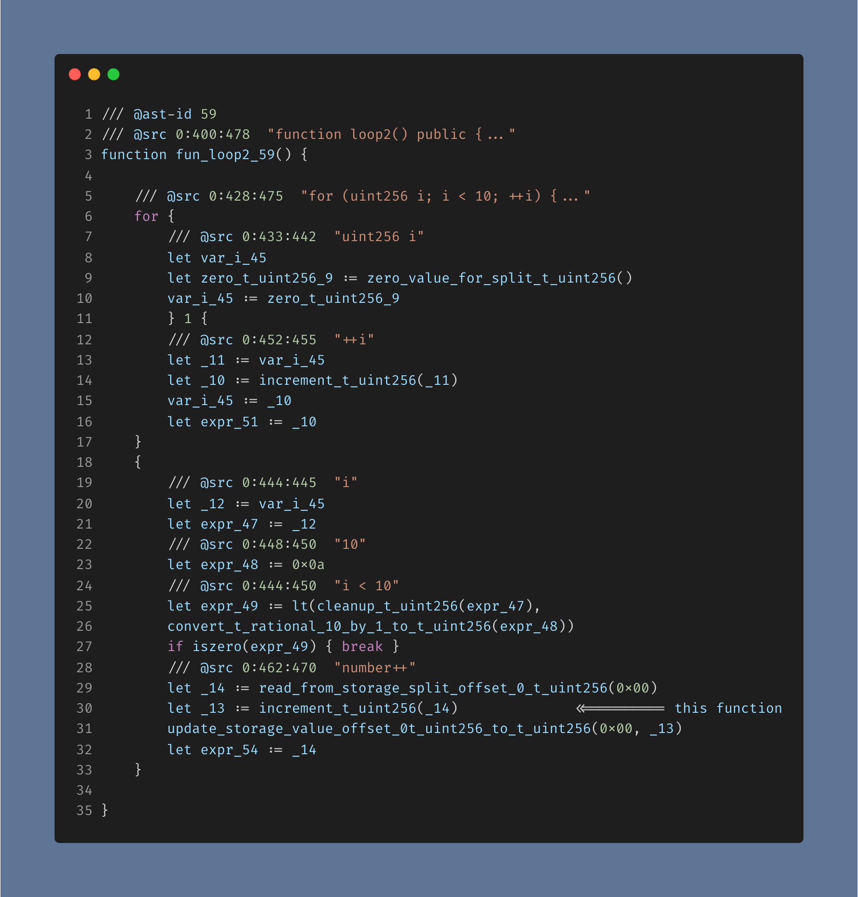
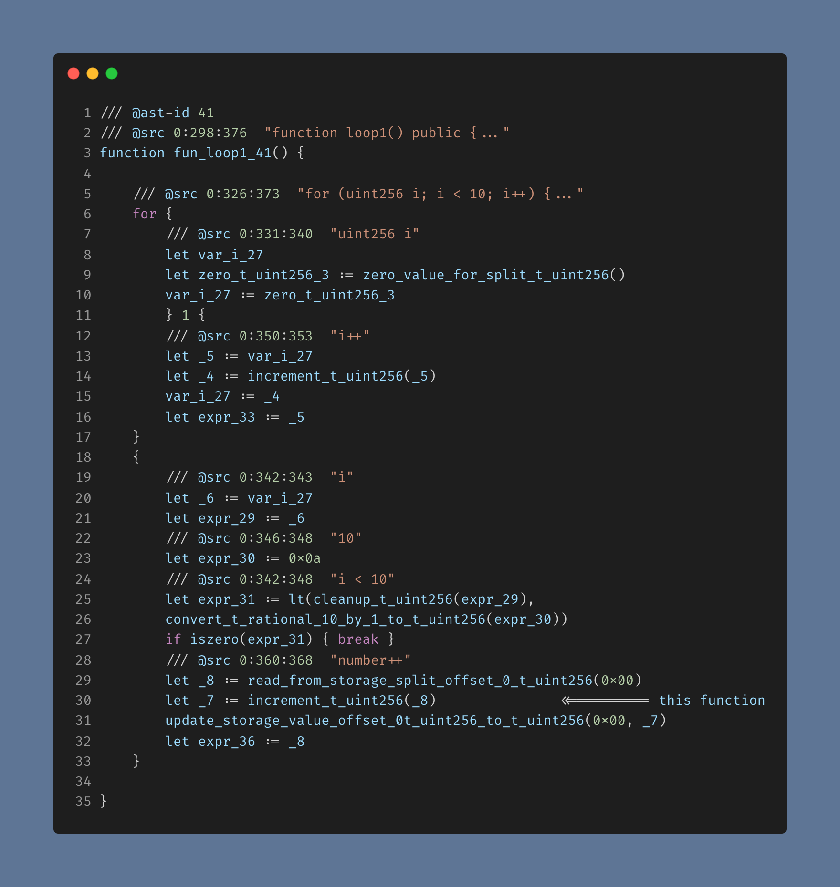
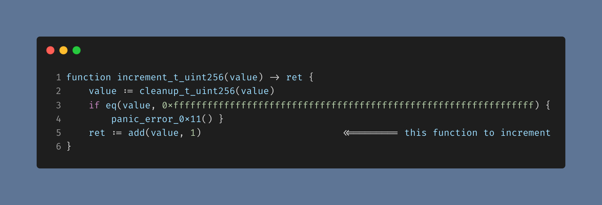
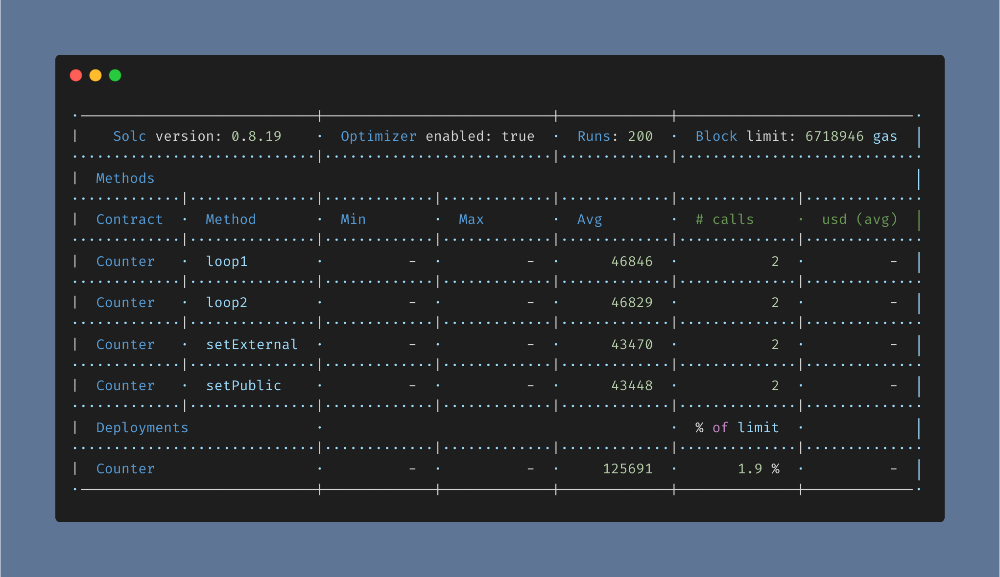
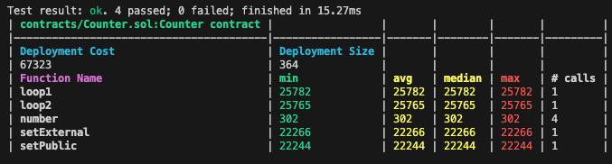

# Gas usage in solidity

## Motivation

- This project aims to compare the gas usage of the smart contracts and their functions written in solidity. We try to do a deep dive into the bytecode of the smart contracts and try to understand the gas usage comparison between the different functions.

## Prerequisites

- Install [foundry](https://book.getfoundry.sh/). Go through the [installation instructions](https://book.getfoundry.sh/getting-started/installation) to install foundry.
- Configure the [foundry.toml](./foundry.toml) as per your requirements. Refer to the [foundry config reference](https://book.getfoundry.sh/reference/config/) for more details.

- Install the project dependencies.

  - Do a check for the latest npm package versions. This will update the versions inside the package.json.

    ```shell
    npx npm-check-updates -u
    ```

  - Use [yarn](https://yarnpkg.com/) (preferred version 3+) to install the dependencies.

    ```shell
    yarn
    ```

    This will install the packages mentioned inside the `package.json` file.

- Compile the smart contracts.

  ```shell
  yarn clean-compile
  ```

## Diving into the smart contract and its bytecode

- The smart contract `Counter`, present inside the [contracts](./contracts) directory, is what we are going to study.

  

- The smart contract has been compiled to generate bytecode through intermediate repersentation (IR) in Yul. Read more about the IR in the [official solidity documentation](https://docs.soliditylang.org/en/latest/ir-breaking-changes.html).\
   To do so, we have set the `viaIR` flag to `true` in the [hardhat.config.js](./hardhat.config.js) file

  ```ts
  solidity: {
    compilers: [
      {
        version: '0.8.19',
        settings: {
          viaIR: true,
          optimizer: {
            enabled: true,
            runs: 200,
          },
        },
      },
    ],
  },
  ```

  and the `via_ir` flag to `true` in the [foundry.toml](./foundry.toml) file.

  ```toml
  via_ir = true
  ```

  The [Yul code](./outputs/yul/Counter.yul) has been generated using the following command using solc. The `ir` flag generates the Intermediate Representation (IR) of the smart contract.

  ```shell
  solc contracts/Counter.sol -o outputs/yul/ --ir
  ```

- ### Bytecode Observations

  Upon closely looking into the [Yul code](./outputs/yul/Counter.yul) generated we can see the following bytecode comparisons.

- ### Comparison between Public and External functions

  - #### Public function (`setPublic`)

  

  - #### External function (`setExternal`)

  

- **Looking closely into the Yul code, we can see that both the bytecode generated for the public and external functions are the same.**

- ### Comparison between pre-increment and post-increment

  - #### Pre-increment (`loop2`)

  

  - #### Post-increment (`loop1`)

  

- **Looking closely into the Yul code, we can see that both the bytecode generated for the pre-increment and post-increment are very much the same.** \
  In line 30 of the Yul code of both the code snippets, we can see that the the function `increment_t_uint256()` is called.
  The function `increment_t_uint256(value)` is defined in the Yul code as follows.

  

  Both the incrementers are using `ret := add(value, 1)`, as shown in line 5 of the above code snippet, to increment the value of the variable by 1.

- ### Gas usage Observations

  Now let's look at the gas usage of the smart contract functions.

  - #### Hardhat gas report

    

  - #### Foundry gas report

    

- ### Gas usage comparisons

  - > `setPublic` < `setExternal`

    - The gas usage of the public function is less than the external function as seen in both the gas reports from hardhat and foundry.

  - > `loop2` < `loop1`

    - The gas usage of the pre-increment is less than the post-increment as seen in both the gas reports from hardhat and foundry.

## Conclusion

- Even though the bytecode (Yul code) of the public and external functions are the same, the gas usage of the public function is less than the external function. Conventionally, what we have known is that the external function consumes less gas as compared to the public function, since only the external function could take `calldata` arguments and the public functions were forced to take the more expensive `memory` arguments. But, in this case, we can see that the gas usage of the public function is less than the external function.

- Even though the bytecode (Yul code) of the pre-increment and post-increment are the same, the gas usage of the pre-increment is less than the post-increment.

- The above conclusions are neither perfect nor do they fully explain the reason behind the observations. But, they do raise some questions as to why the gas usage of the public function is less than the external function and the gas usage of the pre-increment is less than the post-increment, even though the bytecode (Yul code) of both the functions are the same.
