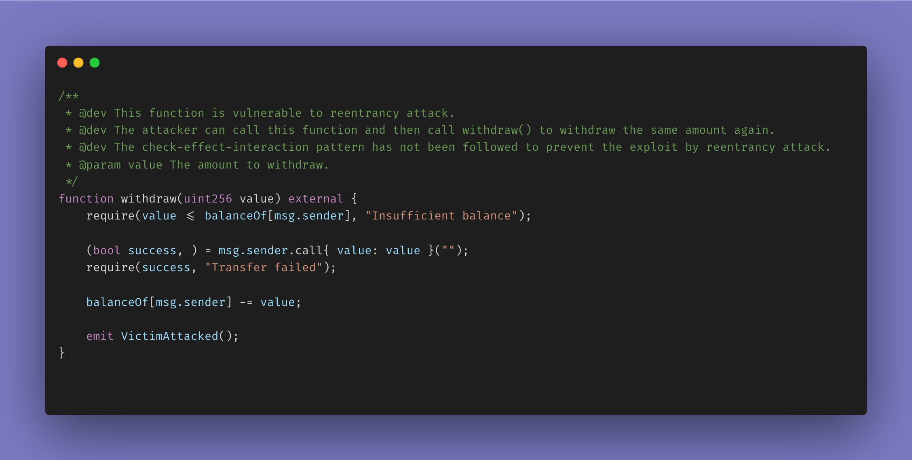
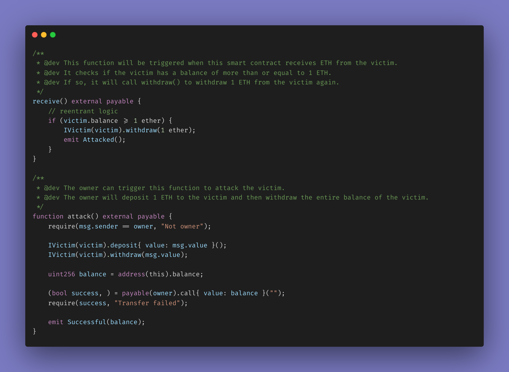
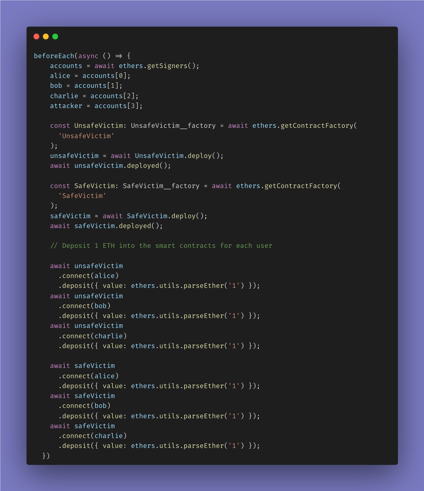
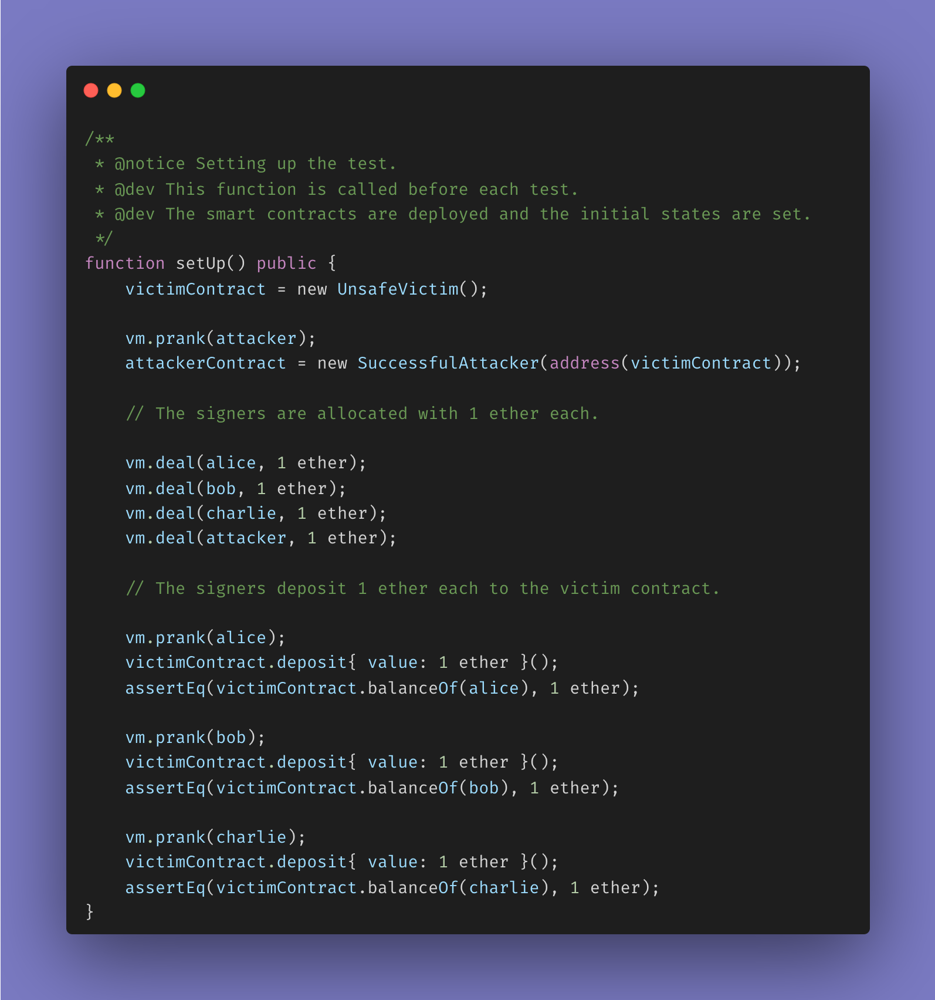
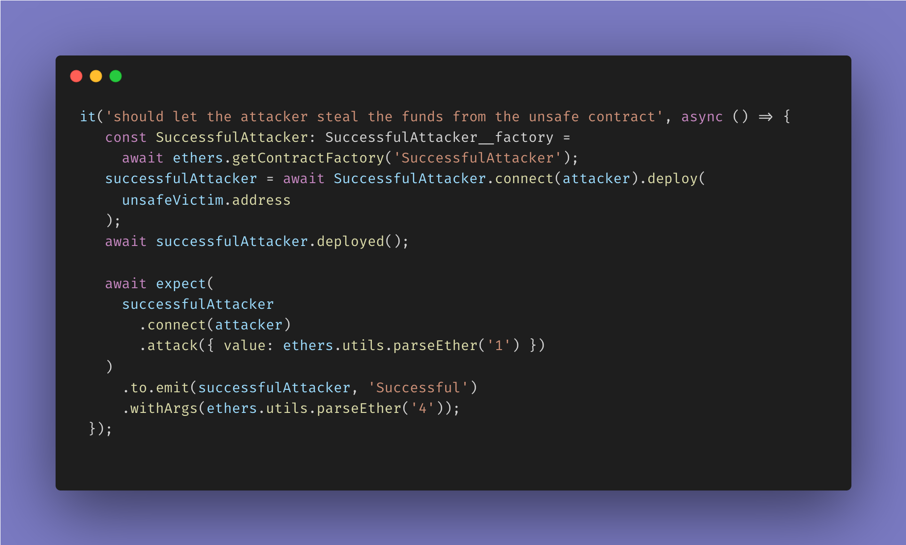
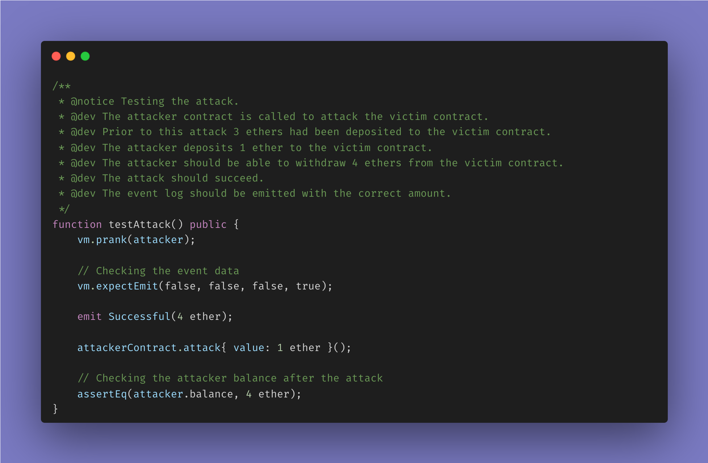
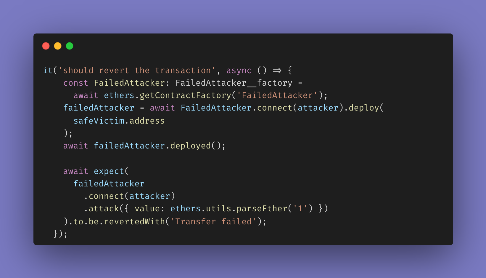
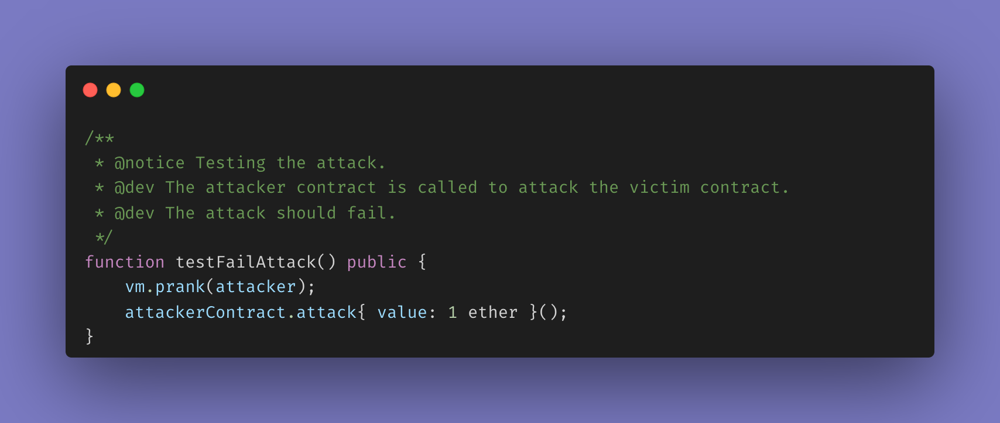
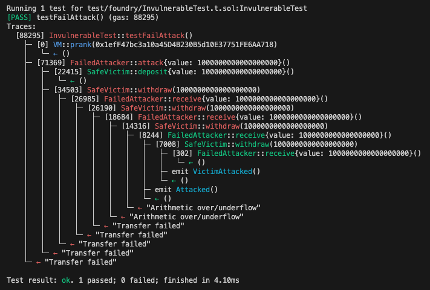

# Not-So-Reentrant

## Motivation

- To demonstrate how a function, inside a smart contract using compiler version `<0.8.0`, can be exploited by reentrancy attacks but not so much with compiler version `>=0.8.0`.

## Prerequisites

- Install [foundry](https://book.getfoundry.sh/). Go through the [installation instructions](https://book.getfoundry.sh/getting-started/installation) to install foundry.
- Configure the [foundry.toml](./foundry.toml) as per your requirements. Refer to the [foundry config reference](https://book.getfoundry.sh/reference/config/) for more details.

- Install the project dependencies.

  - Do a check for the latest npm package versions. This will update the versions inside the package.json.

    ```shell
    npx npm-check-updates -u
    ```

  - ```shell
    git submodule update --init --recursive
    ```

  - Use [yarn](https://yarnpkg.com/) (preferred version 3+) to install the dependencies.

    ```shell
    yarn
    ```

    This will install the packages mentioned inside the `package.json` file.

- Compile the smart contracts.

  ```shell
  yarn clean-compile
  ```

## Diving into the smart contracts

- Both the smart contracts [SafeVictim.sol](./contracts/Invulnerable/SafeVictim.sol) and [UnsafeVictim.sol](./contracts/Vulnerable/UnsafeVictim.sol) have the same functionality. The only difference is that the former uses compiler version `>=0.8.0` and the latter uses compiler version `<0.8.0`.

- Looking into the common vulnerable `withdraw` function of both the smart contracts.

  

  The function does not follow the **Check-Effects-Interactions** pattern. The low-level call is made before the state is updated. This makes the function vulnerable to reentrancy attacks.

- Looking into the attacker smart contracts.

  

  - The attacker address calls the `attack` function which initially deposits some ether into the victim smart contract.
  - Then it calls the `withdraw` function, which calls the `withdraw` function of the victim smart contract, and withdraws the ether amount that was deposited.
  - As soon as the ether is received in the attacker smart contract, the `fallback` function is triggered which again calls the `withdraw` function of the victim smart contract.
  - This process continues until the victim smart contract runs out of ether.
  - If the attack is successful, the attacker smart contract will emit the `Successful` event along with the ether balance.

## Diving into the test cases

- The test cases have been written in both [TypeScript](./test/reentrancy.test.ts) using [Hardhat](https://hardhat.org/) and [Solidity](./test/foundry/) using [Foundry](https://book.getfoundry.sh/).

- The signers `alice`, `bob` and `charlie` are depositing `1 ether` each into the victim smart contract and the attacker smart contract is initialized with the address of the victim smart contract.

  - Hardhat test case smart contract initialization and signers depositing ether into the victim smart contract.
    

  - Foundry test case smart contract initialization and signers depositing ether into the victim smart contract.
    

- Positive test case

  - Hardhat test case
    

  - Foundry test case
    

- Negative test case

  - Hardhat test case
    

  - Foundry test case
    

## But why?

- The `withdraw` function of both the victim smart contracts is vulnerable to reentrancy attacks because the low-level call is made before the state is updated.

- But only the [UnsafeVictim](./contracts/Vulnerable/UnsafeVictim.sol) smart contract is subject to exploitation.

- This is because the `withdraw` function of the [SafeVictim](./contracts/Invulnerable/SafeVictim.sol) smart contract uses compiler version `>=0.8.0` and the `withdraw` function of the [UnsafeVictim](./contracts/Vulnerable/UnsafeVictim.sol) smart contract uses compiler version `<0.8.0`.

- Solidity compiler version `>=0.8.0` has in-built [_arithmetic overflow_ and _underflow_ checks](https://blog.soliditylang.org/2020/12/16/solidity-v0.8.0-release-announcement/). This means that the `withdraw` function of the [SafeVictim](./contracts/Invulnerable/SafeVictim.sol) smart contract will revert if the attacker tries to withdraw more ether than his `balanceOf`.

- If you closely observe the verbose output of the foundry test for the [VulnerableTest.t.sol](./test/foundry/VulnerableTest.t.sol), you will find the following output.
  

- Upon successive reentrancies, the `balanceOf` of the attacker smart contract becomes negative. This causes the `withdraw` function of the [UnsafeVictim](./contracts/Vulnerable/UnsafeVictim.sol) to cause arithmetic underflow and thereby to revert.
